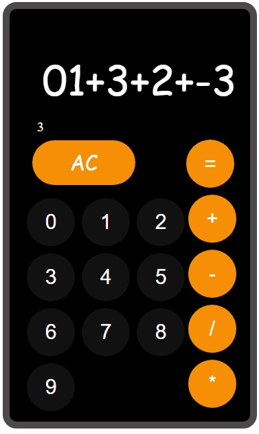

# Simple Calculator

A basic calculator web application built with HTML, CSS, and JavaScript.



## Features

- Addition, subtraction, multiplication, and division operations.
- Clear and reset functionality.
- User-friendly interface.

## Demo

You can try out the calculator here: [Demo](https://your-demo-link.com)

## Getting Started

### Prerequisites

- Web browser (Chrome, Firefox, Safari, etc.)

### Installation

1. Clone the repository:

   ```bash
   git clone https://github.com/your-username/simple-calculator.git
   ```

2. Navigate to the project directory:

   ```bash
   cd simple-calculator
   ```

3. Open `index.html` in your preferred web browser.

## Usage

- Enter numbers using the calculator buttons.
- Click on the operation buttons (+, -, *, /) to perform calculations.
- Use the "C" button to clear the current input.
- Use the "AC" button to reset the calculator.

## Contributing

Contributions are welcome! If you'd like to contribute to this project, please follow these steps:

1. Fork the project.
2. Create your feature branch (`git checkout -b feature/your-feature-name`).
3. Commit your changes (`git commit -m 'Add some feature'`).
4. Push to the branch (`git push origin feature/your-feature-name`).
5. Open a pull request.

## Contact

If you have any questions or suggestions, feel free to contact Tola at [seyifunmiolanisebe3@gmail.com].

